## 🎖️ Desafio
**Caça aos Bugs 2024** é a sexta edição dos **Desafios .NET** realizados pelo [balta.io](https://balta.io). Durante esta jornada, fizemos parte da equipe __NOME_DA_BANDA__ onde resolvemos todos os bugs de uma aplicação e aplicamos testes de unidade no projeto.

## 📱 Projeto
Depuração e solução de bugs, pensamento crítico e analítico, segurança e qualidade de software aplicando testes de unidade.

## Participantes
### 🚀 Líder Técnico
[NOME e GITHUB]

### 👻 Caçadores de Bugs
* [NOME e GITHUB]

## ⚙️ Tecnologias
* C# 12
* .NET 8
* ASP.NET
* Minimal APIs
* Blazor Web Assembly
* xUnit

## 🥋 Skills Desenvolvidas
* Comunicação
* Trabalho em Equipe
* Networking
* Muito conhecimento técnico

## 🧪 Como testar o projeto
[DESCREVER COMO EXECUTAR O PROJETO]

# 💜 Participe
Quer participar dos próximos desafios? Junte-se a [maior comunidade .NET do Brasil 🇧🇷 💜](https://balta.io/discord)

# 🕵️‍♂️ Invetigando os bugs🐞 e coleta de evidências 📖
## 🐞BUG 1 - Erro na Home do App

Após realizado o passo a passo sugerido foi criado o usuário.

```text
email : testedima@email.com
pass  : D1m@D1m@
```

## 🐞BUG 2 - Erro na Home do App

Agora dentro do sistema vamos abrir o DevTools(F12) e indo na aba do network foi constatado o bug descrito no .pdf.


Agora vamos realizar o debug do endpoint expenses chegamos no metodo GetExpensesByReportAsync


Continuando o redug dessa consulta.


Ao executar caimos na exeção.


Realizando a pesquisa dentro da solução encontramos onde está mapeado a view.


Porem olhando no banco não encontramos a view.


Mas procurando no código vimos que temos disponível os scripts para criação.


Nesse ponto poderia pegar os scripts e executalos novamente no banco, porem ao passar para outro dev isso poderia tornar um
habito custoso e que muitas vezes esquecido gerando um tempo para iniciar a aplicação maior, por isso escolhi executando o comando para criar um nova migration para incluir os scripts e deixar o processo mais automatizado.

```bash
dotnet ef migrations add CreateViews
```

E lá vamos nós novamente novamente subir a migration.

```bash
dotnet ef database update 
```


Antes de volta para o nosso querigo debug do código, vi que havia uma pasta chamda Scripts com um seed.sql já que criamos uma migration para as views, por que não já criar um para o seeds😎.

```text
🚨🚨🚨🚨 
Em uma aplicação real, existem seeds que PRECISÃO estar em produção (exemplo tabelas de tipos/types), e outros seeds que servem apenas para o desenvolvimento, então essa ação pode não ser a recomendada no dia dia, mas é questão de avaliar caso a caso.
🚨🚨🚨🚨 
```

Discrime feito, borá criar o migration para aplicar os seeds.

```bash
dotnet ef migrations add ApplySeeds
```

E lá vamos nós novamente novamente.

```bash
dotnet ef database update 
```

Validando se os migrations forão aplicados.


Validando se uns dos seed foi aplicado.


Voltando a DevToolts na aba network vimos que não temos mais os erros.


E na tela inicial terminou de carregar.


## 🐞BUG 3 - Categorias não lista

Ao entrar na tela de categorias, recebemos a mensagem de erro descrito no documentos de bugs.

<div style"color=red"> Oject reference not set to an instance of an object.</div>

Ao verificar no DevTools, pode-se verificar que não apresenta nenhum erro.

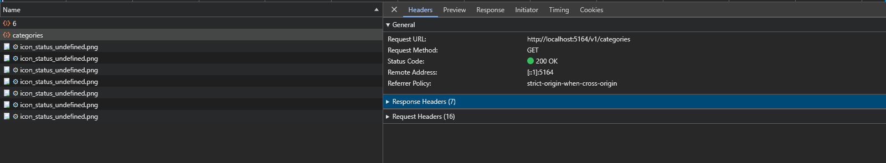

Então vamos analizar o codigo da tela, e ao abrir a IDE já está apontando um aviso da lista não instanciada.

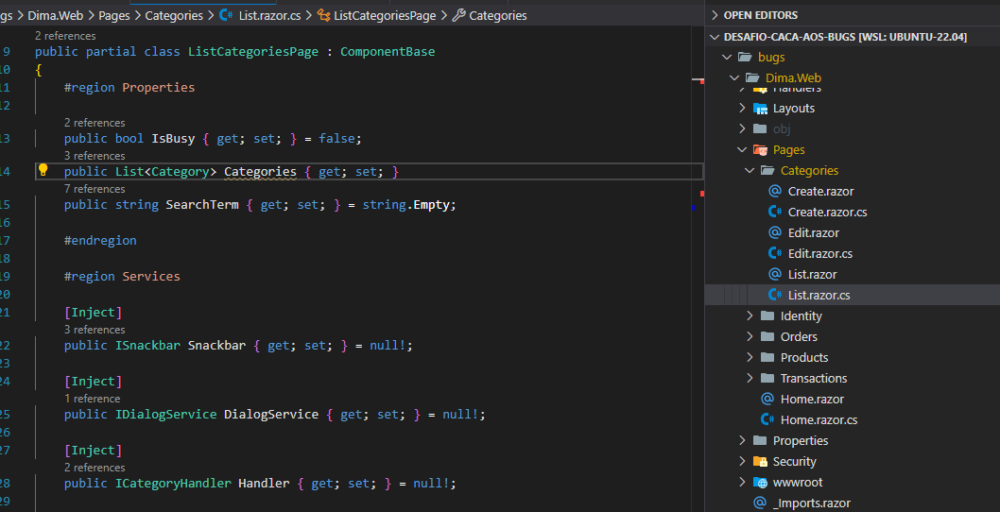

E outro aviso que pode estar dentando inserir na coleção um objeto que pode estar vazio.

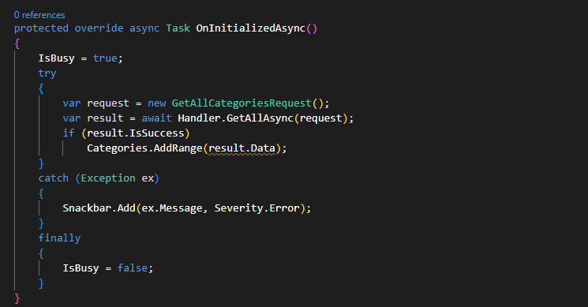

Vamos aplicar a correção de instanciar a lista que é apresentada na tela, e um tratamento para não inserir um objeto vazio e sim um lista vazia.


Agora realizando o teste novamente, pode-se ver que a pela carregou normalmente, borá para o proximo bug que o negócio está ficando quente🔥.


## 🐞BUG 4 - Categoria não é criada

Ao tentar replicar o erro de criar uma categoria recebemos o erro abaixo, o erro é diferente do apresentado, mas bora atrás da correção.

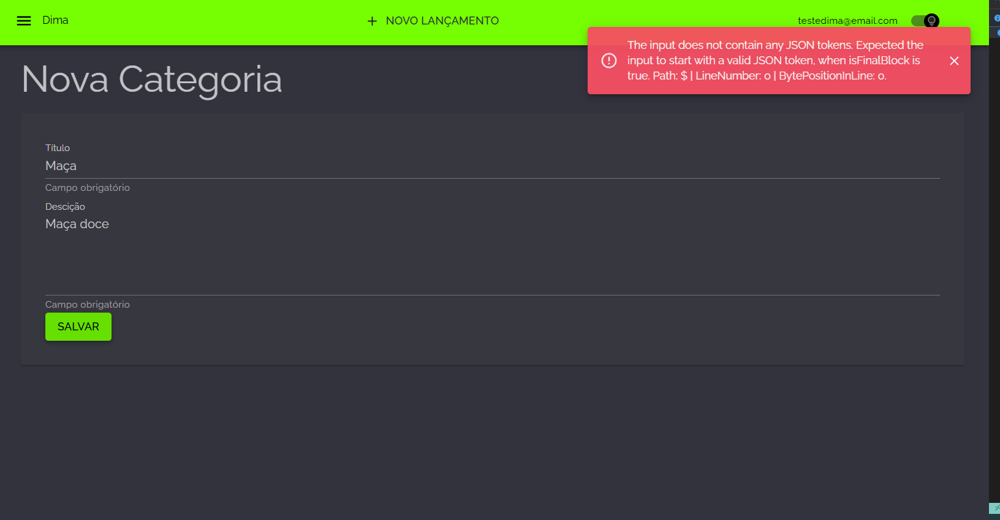

No projeto Web vamos ferificar o hanldle de criação, aqui já chama atenção o está com methodo http put, porem antes de alterar vamos verificar a implementação na api.

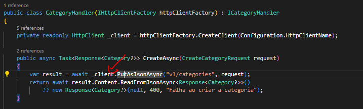

Verificando a implementação na api é possivle ver que a implemntação está como metodo http post, agora fazendo sentido o erro.

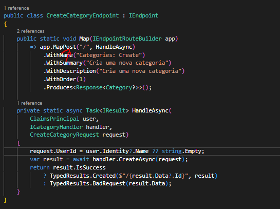

Vamos ajustar a implmentação para o metodo http post que foi implementado e por convenção para criação é o correto a ser aplicado.

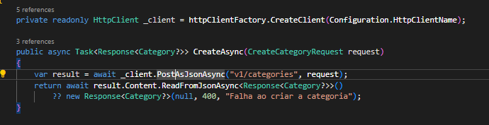

Realizando um novo teste de salvamento.

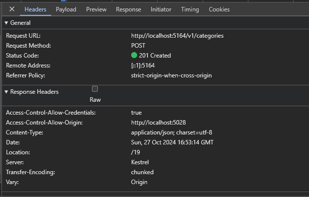

Voltando na tela de listagem podemos ver o nosso registro criado corretamente.

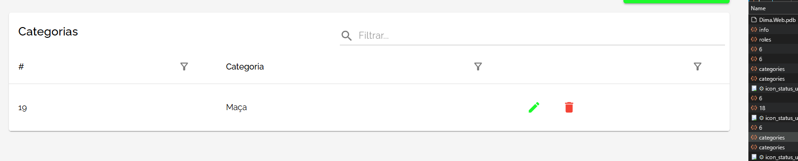

Trem que pula, bora gente, só falta mais dois bugzinhos 🐞 para terminarmos nossa jornada.

## 🐞BUG 5 - Transação é criada mas não aparece

Agora vamos para a parte de transação, ao tentar replicar o erro recebemos a mensagem que transação foi salva.

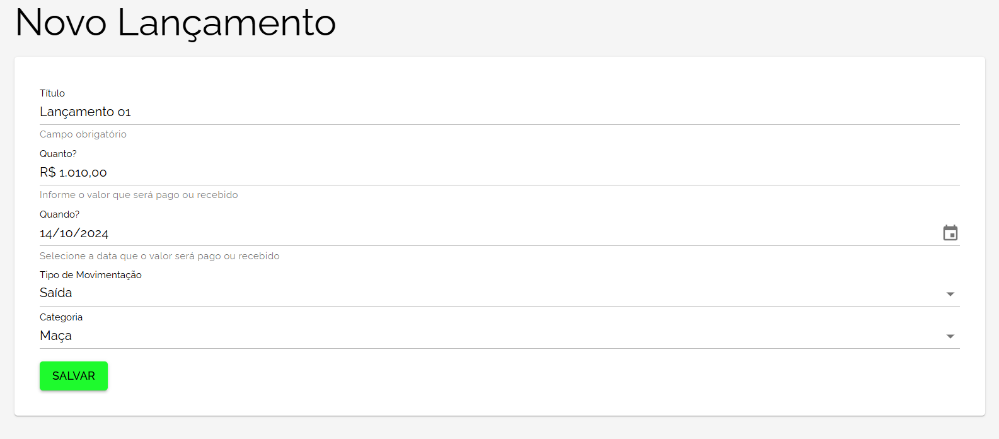

Ao ferificar o dev tools, não temos nenhum erro para obter a lista.

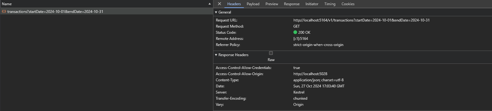

Porem ao checar o bnaco de dados pode-se verificar que nosso registro não foi salvo 😨.

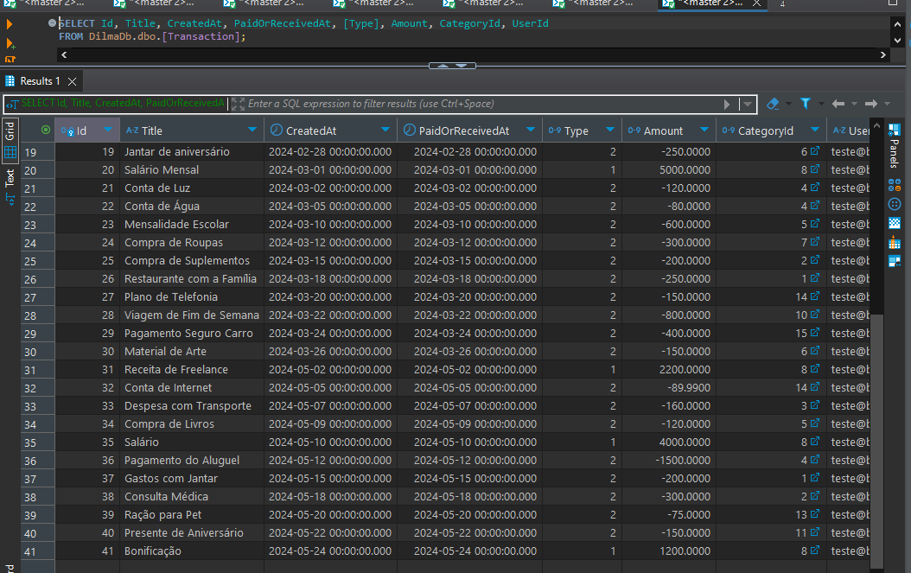

Ao abrir o handler de salvamento a IDL nossa amiga 😗 já está dando dois warning onde está realizando operações assincronar sem utilizar o await, bora adicionar o await e testar novamente.

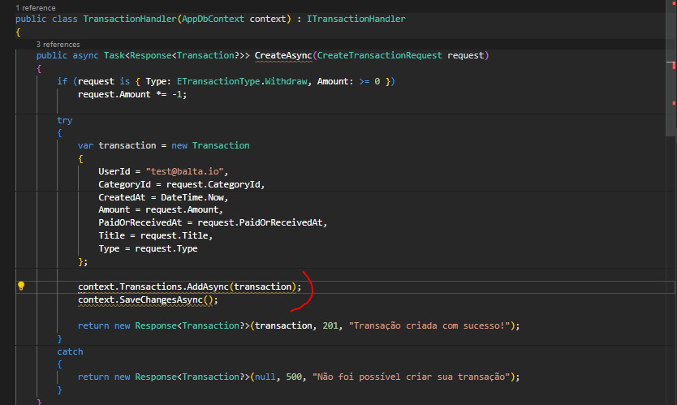

Criando uma nova transação, agora vai.

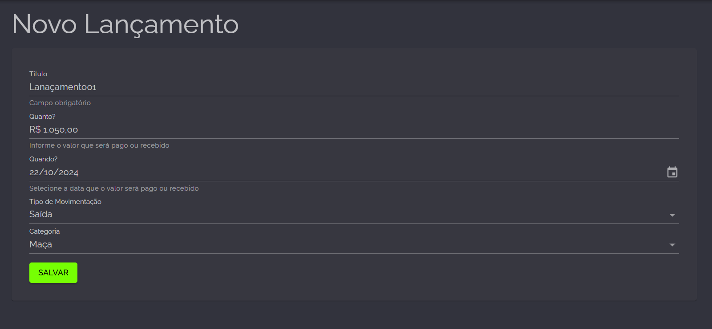

Vixi nossa transação foi salva, porem ficou com o id de outro usuário 😅, melhor que nada né.

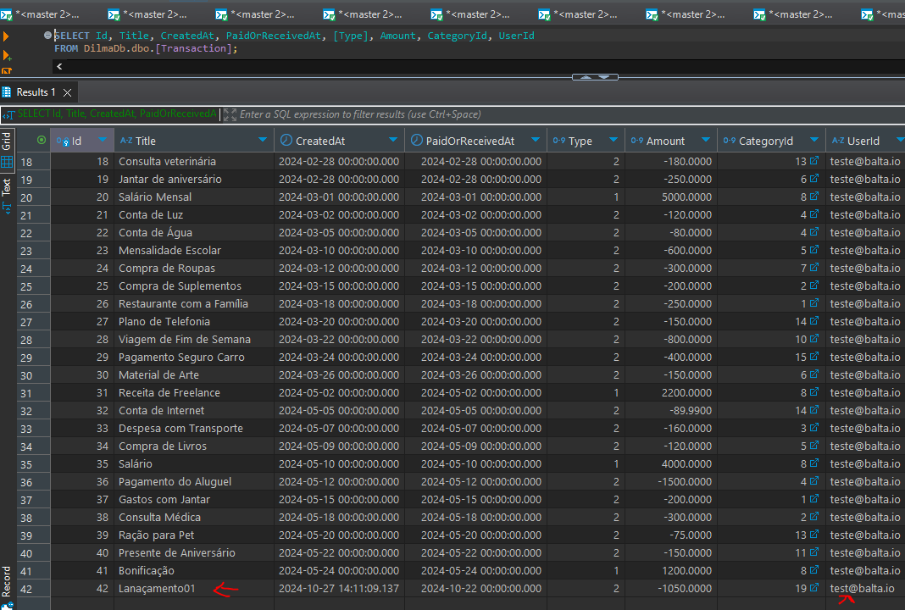

Voltando ao codigo, bora ajustar o preenchimento com o user id da requisição.

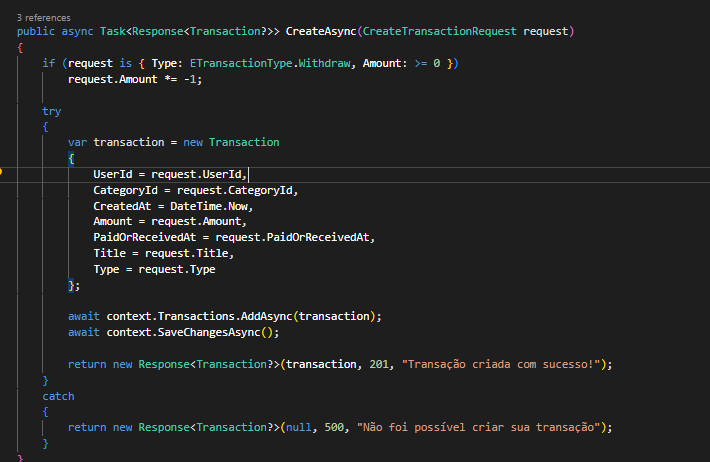

E lá vamos nós 🚂, criar outra transação.

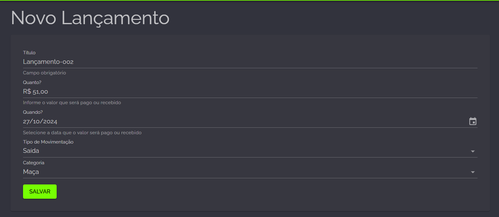

Agora listou na tela, ufa😁.

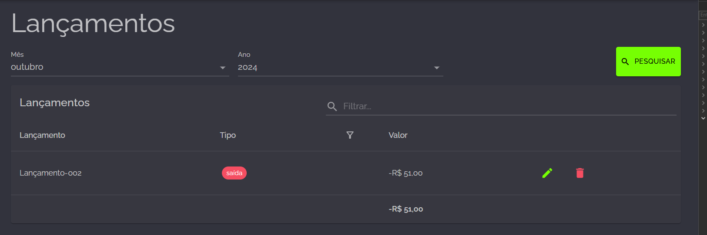

Olhando na base tb pode-mos verificar que o registro agora está para o nosso userid.


## 🐞BUG 6 - Atualização de uma transação não funciona

Chegamos no ultimo chefão, bora acabar com ele 💪.

Ao tentar editar o registro, somos recebido com o erro. 

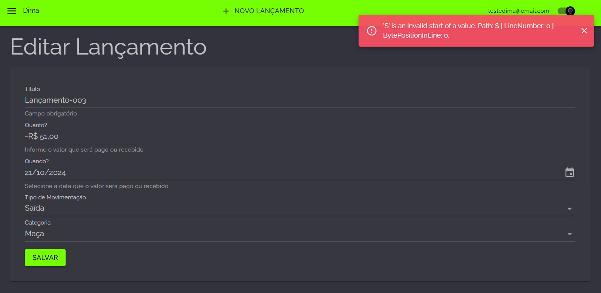

Porem ao realizar a correção do BUG 5, já foi possivel ver que no TransactionHandler o updateAsync havia sido esquecido de ser implementado, algum deve estava com pressa de terminar sua User Story 😒, espero que ainda não tenha passado pelo PR-Review 🙏.

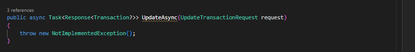

Vamos implementar o codigo, sem dar ctrl+c e ctrl+v no categoria e trocar as variáveis e descrição.

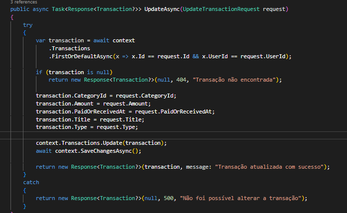

agora com o metodo implementado vamos realizar outro teste de edição.

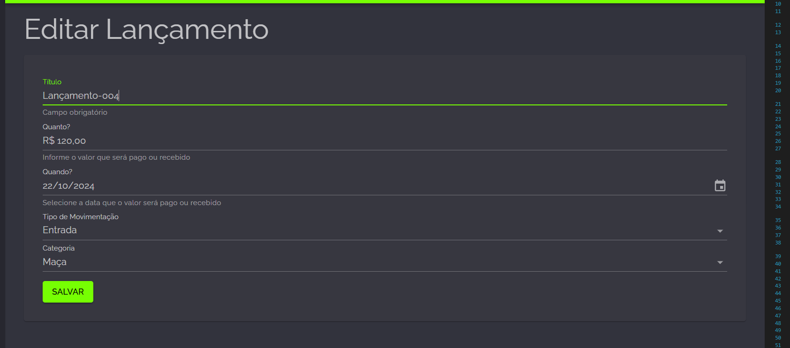

Aeeeeee, registro editado com sucesso.

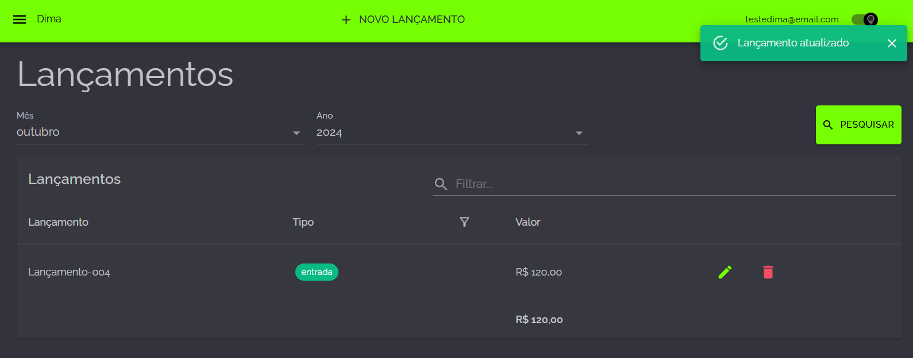