## 🎖️ Desafio
**Caça aos Bugs 2024** é a sexta edição dos **Desafios .NET** realizados pelo [balta.io](https://balta.io). Durante esta jornada, fizemos parte da equipe __NOME_DA_BANDA__ onde resolvemos todos os bugs de uma aplicação e aplicamos testes de unidade no projeto.

## 📱 Projeto
Depuração e solução de bugs, pensamento crítico e analítico, segurança e qualidade de software aplicando testes de unidade.

## Participantes
### 🚀 Líder Técnico
[NOME e GITHUB]

### 👻 Caçadores de Bugs
* [NOME e GITHUB]

## ⚙️ Tecnologias
* C# 12
* .NET 8
* ASP.NET
* Minimal APIs
* Blazor Web Assembly
* xUnit

## 🥋 Skills Desenvolvidas
* Comunicação
* Trabalho em Equipe
* Networking
* Muito conhecimento técnico

## 🧪 Como testar o projeto
[DESCREVER COMO EXECUTAR O PROJETO]

# 💜 Participe
Quer participar dos próximos desafios? Junte-se a [maior comunidade .NET do Brasil 🇧🇷 💜](https://balta.io/discord)

# 🕵️‍♂️ Invetigando Bugs🐞 e coleta de evidências 📖
## 🐞BUG 1 - Erro na Home do App

Após realizado o passo a passo sugerido foi criado o usuário.

```text
email : testedima@email.com
pass  : D1m@D1m@
```

## 🐞BUG 2 - Erro na Home do App

Agora dentro do sistema vamos abrir o DevTools(F12) e indo na aba do network foi constatado o bug descrito no .pdf.

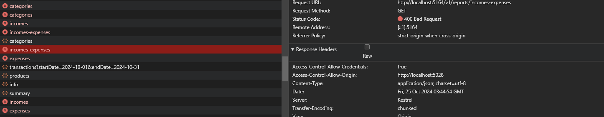

Agora vamos realizar o debug do endpoint expenses chegamos no metodo GetExpensesByReportAsync

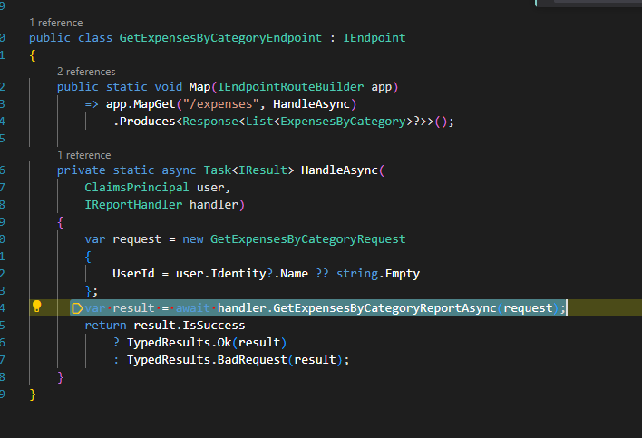

Continuando o redug dessa consulta.

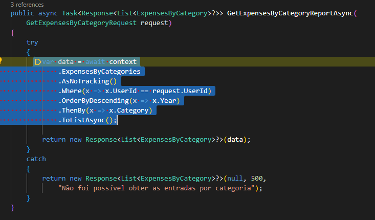

Ao executar caimos na exeção.

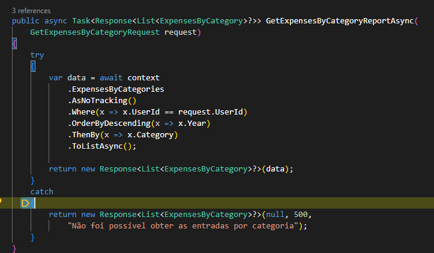

Realizando a pesquisa dentro da solução encontramos onde está mapeado a view.

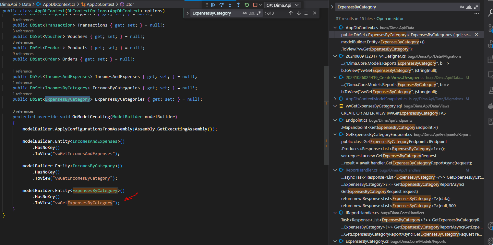

Porem olhando no banco não encontramos a view.

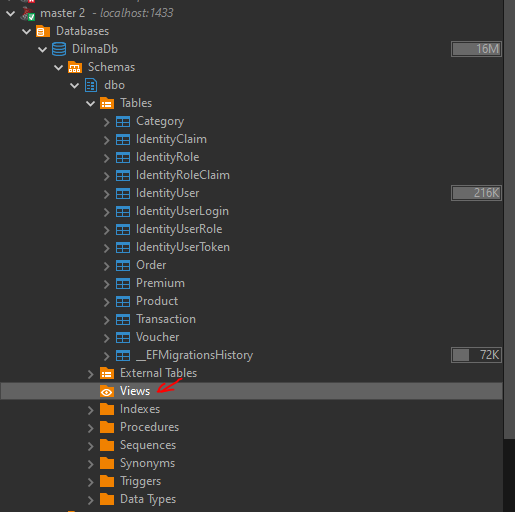

Mas procurando no código vimos que temos disponível os scripts para criação.

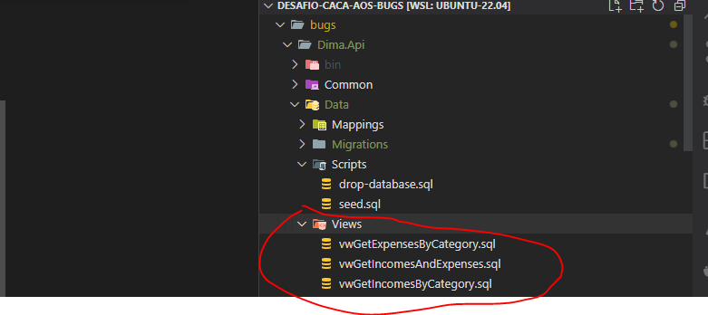

Nesse ponto poderia pegar os scripts e executalos novamente no banco, porem ao passar para outro dev isso poderia tornar um
habito custoso e que muitas vezes esquecido gerando um tempo para iniciar a aplicação maior, por isso escolhi executando o comando para criar um nova migration para incluir os scripts e deixar o processo mais automatizado.

```bash
dotnet ef migrations add CreateViews
```

E lá vamos nós novamente novamente subir a migration.

```bash
dotnet ef database update 
```

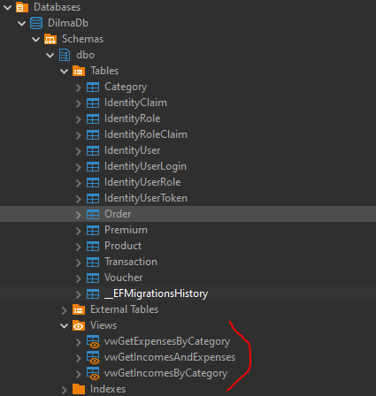

Antes de volta para o nosso querigo debug do código, vi que havia uma pasta chamda Scripts com um seed.sql já que criamos uma migration para as views, por que não já criar um para o seeds😎.

```text
🚨🚨🚨🚨 
Em uma aplicação real, existem seeds que PRECISÃO estar em produção (exemplo tabelas de tipos/types), e outros seeds que servem apenas para o desenvolvimento, então essa ação pode não ser a recomendada no dia dia, mas é questão de avaliar caso a caso.
🚨🚨🚨🚨 
```

Discrime feito borá criar o migration para aplicar os seeds.

```bash
dotnet ef migrations add ApplySeeds
```

E lá vamos nós novamente novamente.

```bash
dotnet ef database update 
```

Validando se os migrations forão aplicados.

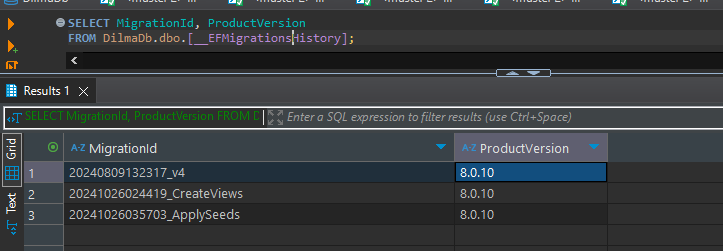

Validando se uns dos seed foi aplicado.

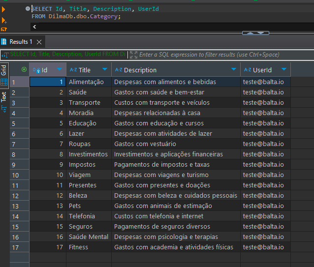

Voltando a DevToolts na aba network vimos que não temos mais erros.

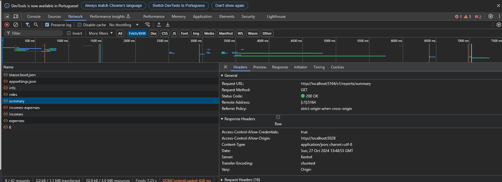

E na tela inicial terminou de carregar.
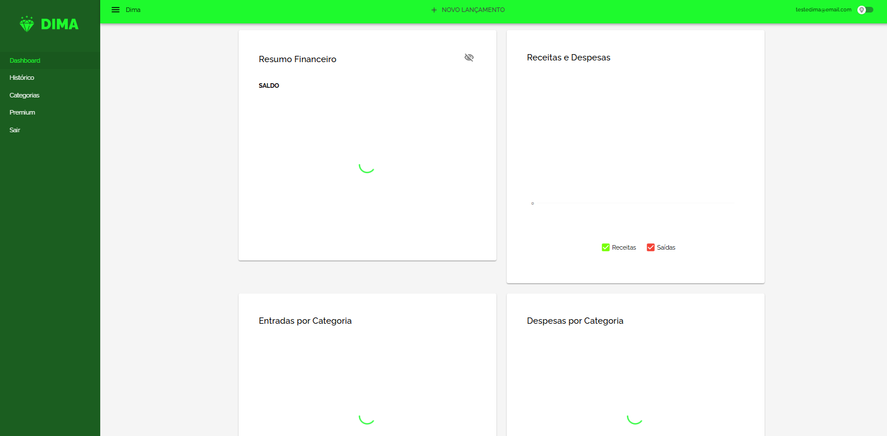

## 🐞BUG 3 - Categorias não lista

Ao entrar na tela de categorias, recebemos a mensagens de erro.

Ao verificar no DevTools vimos que não tem nenhum erro.

Então vamos analizar o codigo da tela.

